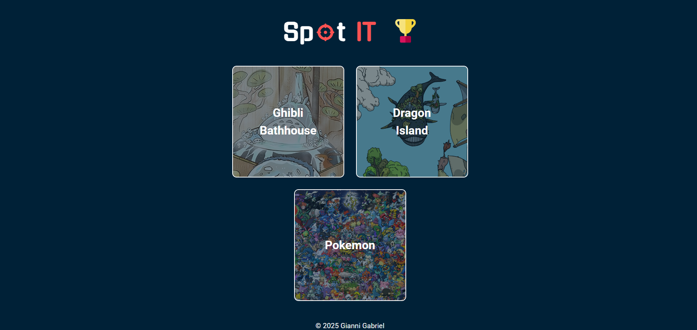
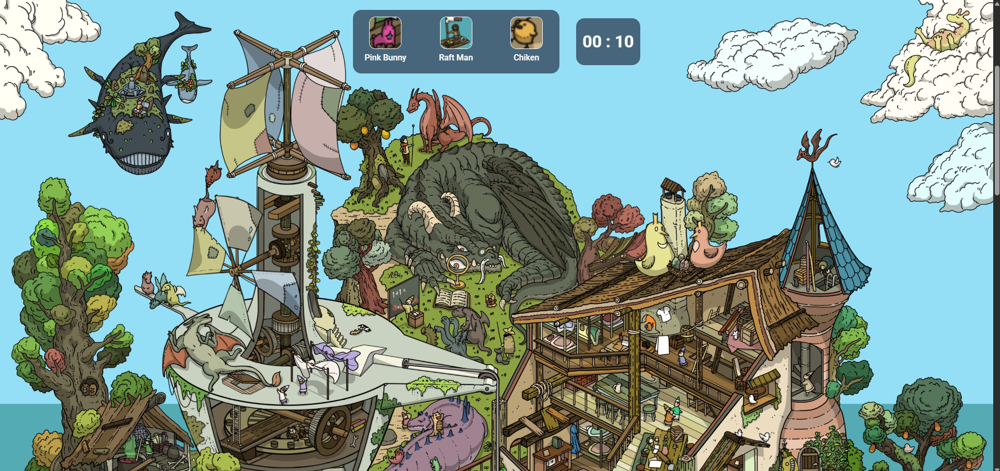
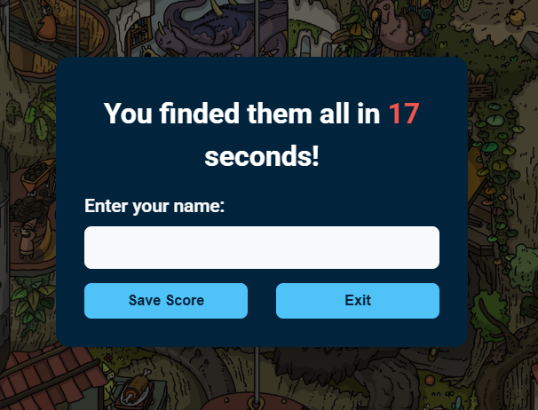
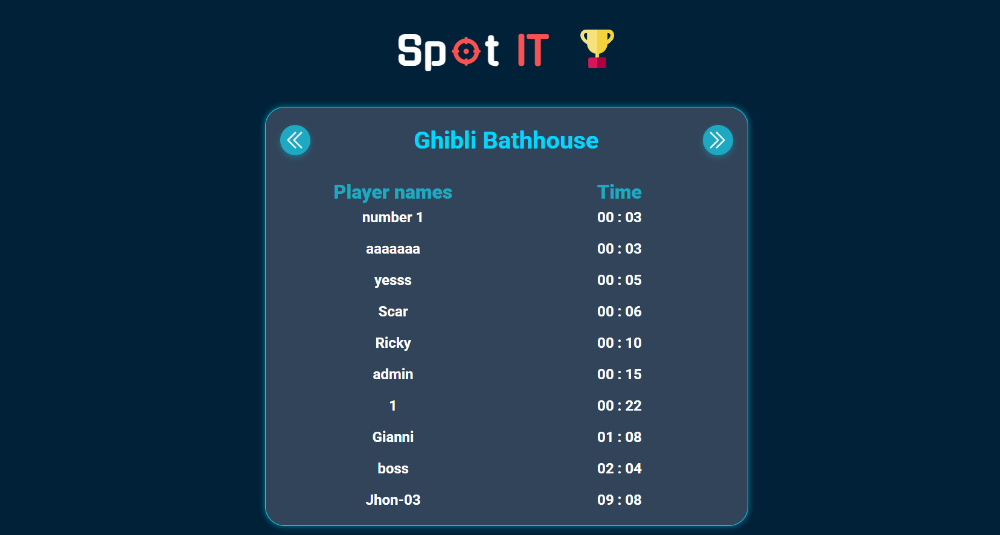

# 🎮 Tag character game - Full Stack Project

This is a **full stack game** built with **Node.js + Express** on the backend and **React** on the frontend.  
The game consists in finding the characters that are asked inside an image, there are three available games, the backend aditions to this games are for making the game **uncheatable**, and also for adding leaderboards for the scores that the players make

---
### 📸 Screenshots

#### **Home View**


#### **Game View**


#### **Win Dialog**


#### **Leaderboard View**


## ✨ Features

### 🛡️ Game Uncheatable
- The coordinate of the characters are inside the daabase so no normal user can see where the charcters are located from the beginning
- The score can't also be cheated becouse the time is being counted also on the backend side since you start playing a game 

### 🖱️ Click detection on images
- When a user clicks in any part of the image of the game a percentage is calculed on X and Y axis 
- After that it checks with the database if a character is in these coords or not 

### ⚡ Frontend
- Built with **React + Tailwind**.  
- Modern UI with **responsive design**.  
- Client-side routing for pages.

---

## 🛠️ Technologies Used

### Backend
- 🟢 **Node.js + Express** – Server and API.  
- 🗄️ **MySql** (I'm using prisma) – Database for games users, leaderboard and  coords in the image of characters.  
- 🛡️ **express-validator** – Input validation middleware.  

### Frontend
- ⚛️ **React** – Client-side UI.  

## 🚀 Installation Guide

Follow these steps to set up and run the project locally:

### 1. Clone the Repository
```bash
git clone <repository-url>
cd findPictureGame
```

### 2. Install Backend Dependencies
Move to `Backend` folder and install dependencies
```bash
cd BACKEND
npm install
```

### 3. Configure Environment Variables
Create a `.env` file inside the `BACKEND` folder with the following variables:
```env
DB_URL=your_database_url
```

### 4. Set Up Database with Prisma
Generate `Prisma client` and synchronize your database:
```bash
    npx prisma generate
    npx prisma migrate dev --name init
```
### 5. Seed the Database
```bash
npm run seed
```

### 6. Start the Backend Server
```bash
cd ..
npm run dev
```

### 7. Install Frontend Dependencies
Navigate to the `FRONTEND` folder and install the required dependencies:
```bash
cd FRONTEND
npm install
```

### 8. Start the Frontend Server
Run the following command to start the frontend development server:
```bash
npm run dev
```

### 9. Open the Application
Once the frontend server is running, open the provided link in your browser (usually `http://localhost:5173`).

---
